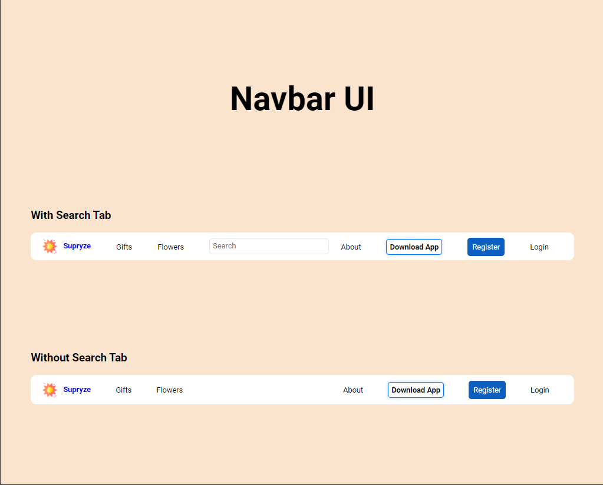
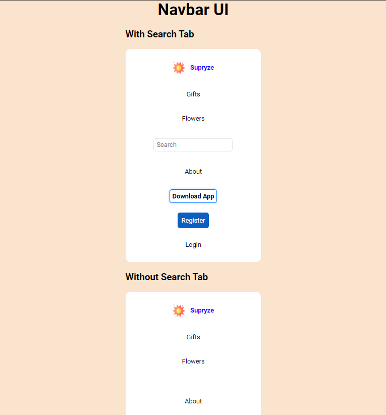

<h1>Interfaz de usuario de la barra de navegación<h1>
Con pestaña de búsqueda:
Incluye un logotipo o nombre de marca “Supyrzz”.
Botones o enlaces para “Gifts” y “Flowers”.
Un campo de entrada para búsqueda.
Enlaces adicionales para “Search”, “About”, “Download App”, “Register” y “Login”.
###Sin pestaña de búsqueda:
Los mismos elementos que la variante anterior, excepto que no tiene el campo de búsqueda ni el enlace “Search”
###<h2>Estilos responsivos<h2>
Resolucion 1024px:

Resulocion 768px:

Resolucion 400px:

