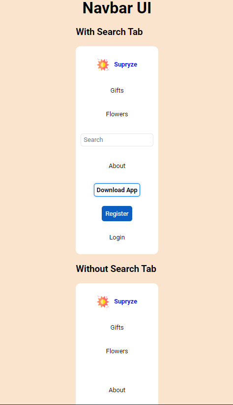

### Interfaz de usuario de la barra de navegación
Una barra de navegación (o Navbar) es un componente común en el diseño de sitios web. Por lo general, se encuentra en la parte superior o en un lateral de la página y proporciona enlaces o botones para navegar a diferentes secciones del sitio. 
Con pestaña de búsqueda: 
Incluye un logotipo o nombre de marca “Supyrzz”. 
Botones o enlaces para “Gifts” y “Flowers”. 
Un campo de entrada para búsqueda. 
Enlaces adicionales para “Search”, “About”, “Download App”, “Register” y “Login”. 
Sin pestaña de búsqueda: 
Los mismos elementos que la variante anterior, excepto que no tiene el campo de búsqueda ni el enlace “Search”  
En el siguiente apartado podemos visualizar los diferentes Estilos responsivos
Resolucion 1024px:

  
Resulocion 768px:

  
Resolucion 400px:  
 
